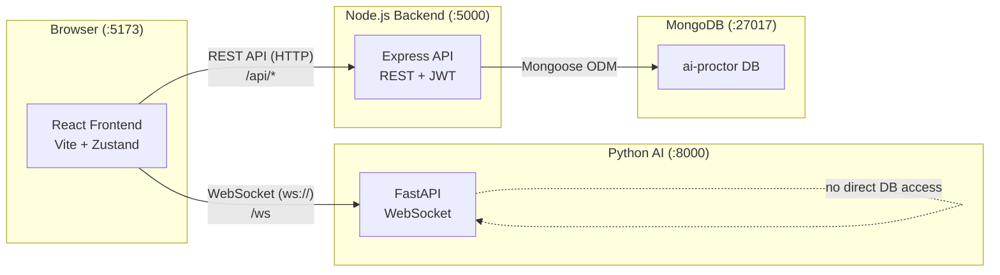
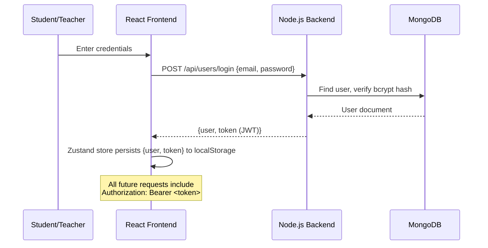
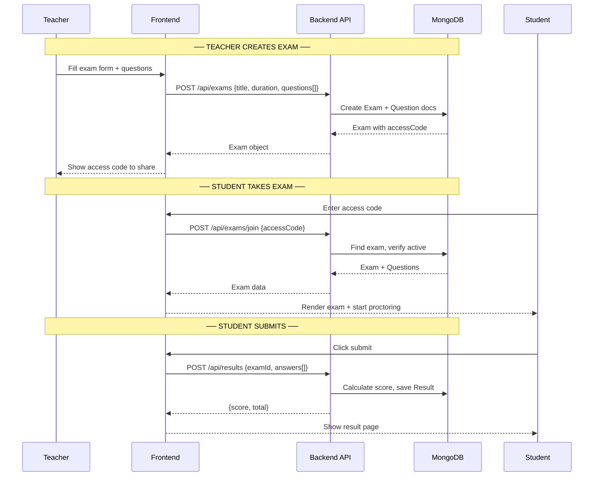
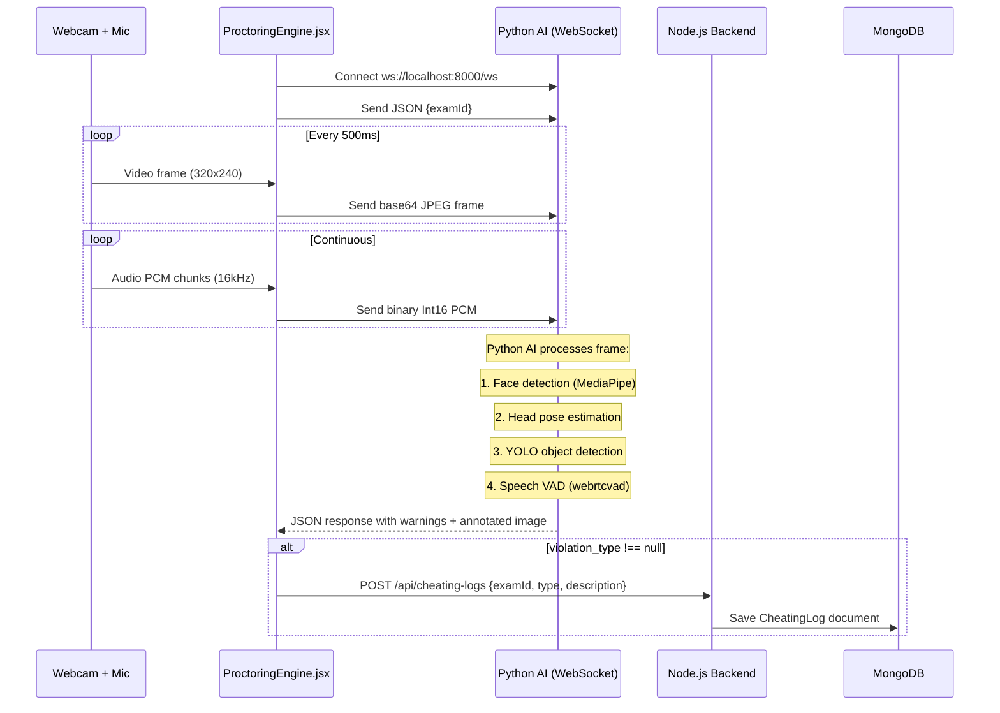
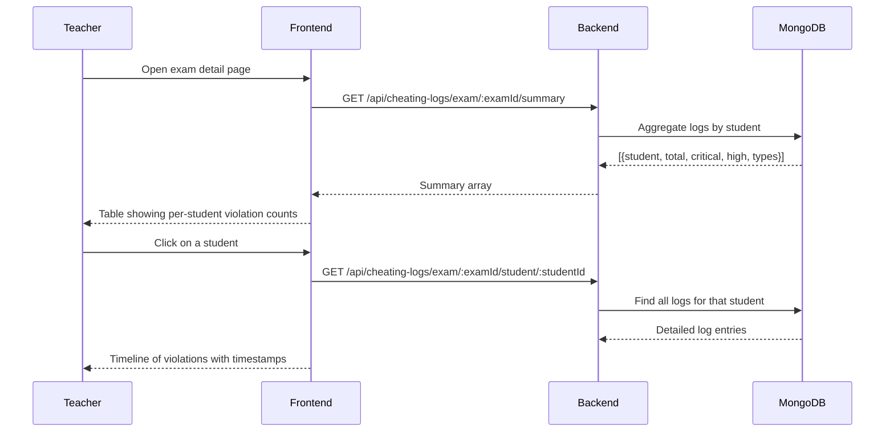

# AI Proctor — Data Flow

## Architecture Overview



The system is **3 services + 1 database**:

| Service | Port | Role |
|---|---|---|
| **React Frontend** | `5173` | UI, webcam/mic capture, browser event monitoring |
| **Node.js Backend** | `5000` | REST API, auth (JWT), all DB operations |
| **Python AI** | `8000` | Real-time AI analysis (face, head pose, speech, YOLO) |
| **MongoDB** | `27017` | Stores users, exams, questions, results, cheating logs |

> [!IMPORTANT]
> The Python AI server has **no database access**. It only analyzes frames/audio and returns results. The frontend is responsible for persisting violations to the backend.

---

## 1. Authentication Flow



**Key files:**
- [authStore.js](file:///c:/Users/mo7am/Desktop/ai%20v%205/ai-proctor/frontend/src/store/authStore.js) — Zustand store, persists to `localStorage`
- [axios.js](file:///c:/Users/mo7am/Desktop/ai%20v%205/ai-proctor/frontend/src/api/axios.js) — Interceptor auto-attaches JWT to every request
- [userController.js](file:///c:/Users/mo7am/Desktop/ai%20v%205/ai-proctor/backend/controllers/userController.js) — Login/register logic

---

## 2. Exam Lifecycle (Teacher → Student → Results)



---

## 3. Real-Time AI Proctoring (The Core Loop)

This is the most important flow — it runs continuously during the exam.



### What Python AI Returns (per frame)

```json
{
  "warning": "Cheating: Looking Away",
  "warnings": ["Cheating: Looking Away", "Phone Detected"],
  "violation_type": "suspicious_movement",
  "exam_id": "665a...",
  "image": "data:image/jpeg;base64,..."
}
```

### Warning → Violation Type Mapping

| Python Warning | `violation_type` stored in DB |
|---|---|
| `"No Person Detected"` | `no_face_detected` |
| `"Multiple People Detected"` | `multiple_faces` |
| `"Phone Detected"` | `cell_phone_detected` |
| `"Cheating: Looking Away"` | `suspicious_movement` |
| `"Speech Detection"` | `speech_detected` |

### Browser-Side Violations (no Python involved)

The frontend also detects these directly and logs them to the backend:

| Event | `violation_type` |
|---|---|
| Tab switch / window blur | `tab_switch` |
| Exit fullscreen | `fullscreen_exit` |
| Ctrl+C / Ctrl+V / Ctrl+X | `copy_paste_attempt` |
| Right-click | `right_click_attempt` |
| F12 / Ctrl+Shift+I | `browser_dev_tools` |
| Mic access denied | `microphone_muted` |

> [!NOTE]
> All violations are **debounced** (10 second cooldown per type) in [ProctoringEngine.jsx](file:///c:/Users/mo7am/Desktop/ai%20v%205/ai-proctor/frontend/src/components/proctoring/ProctoringEngine.jsx#L5) to avoid flooding the database.

---

## 4. Teacher Reviews Cheating Logs



---

## 5. Complete Request Path Summary

```
┌─────────────────────────────────────────────────────────┐
│                    BROWSER (React)                       │
│                                                         │
│  Zustand Store ←→ localStorage (JWT + user)             │
│                                                         │
│  axios.js ──── HTTP + JWT ────→ :5000 (Node.js)         │
│    /api/users/*                  │                      │
│    /api/exams/*                  ├──→ MongoDB            │
│    /api/results/*                │                      │
│    /api/cheating-logs/*          │                      │
│                                                         │
│  ProctoringEngine.jsx            │                      │
│    ├── WebSocket ──────────────→ :8000 (Python AI)      │
│    │    ├── sends: JPEG frames (text)                   │
│    │    ├── sends: PCM audio (binary)                   │
│    │    └── receives: warnings + annotated image        │
│    │                                                    │
│    └── On violation ──→ POST /api/cheating-logs ──→ DB  │
└─────────────────────────────────────────────────────────┘
```

---

## Port & Protocol Quick Reference

| From | To | Protocol | Data |
|---|---|---|---|
| Frontend | Backend | HTTP REST (JWT) | CRUD for users, exams, results, logs |
| Frontend | Python AI | WebSocket | Video frames (base64) + audio (PCM binary) |
| Python AI | Frontend | WebSocket | JSON warnings + annotated JPEG |
| Backend | MongoDB | TCP (Mongoose) | All persistence |
| Frontend | Frontend | localStorage | Auth token + user object |
