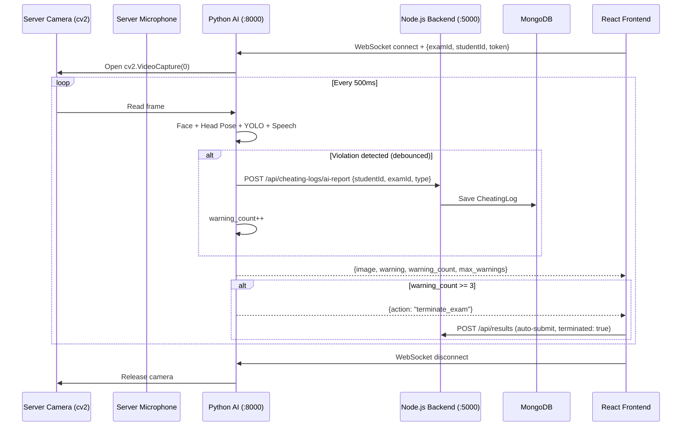

# Implementation Plan: Independent AI Camera + 3-Warning System

## Current Architecture (What We Have Now)

```
React Webcam → captures frame → sends base64 over WebSocket → Python AI → returns warnings
React receives warnings → if violation → POST /api/cheating-logs → MongoDB
```

**Problems:**
1. Python AI is **passive** — it only processes frames the React webcam sends
2. The warning system counts violations but doesn't have a clean "3 strikes" mechanism tied to the camera feed
3. All cheating log persistence goes through the **student's browser** (student could block it)

---

## Target Architecture (What We Want)

```
Python AI → opens camera directly (cv2.VideoCapture) → processes frames independently
Python AI → on violation → POST to Node.js backend → MongoDB
Python AI → sends annotated frame + warnings + warning_count back to React over WebSocket
React → receives warning_count → if >= 3 → auto-submit exam
```

**Key changes:**
1. Python captures camera **itself** using OpenCV — no more React Webcam frames
2. Python tracks a **per-session warning counter** (3 strikes) with debounce
3. Python **directly calls** the Node.js backend to save cheating logs (no longer relying on the student's browser)
4. React still receives the annotated video feed + warning count for UI display
5. React auto-terminates the exam when warning count hits 3

---

## Files to Change

### Phase 1: Python AI — Independent Camera + Warning Counter + Backend Logging

#### 1.1 `python-ai/server.py` (Major rewrite of WebSocket handler)

Changes:
- On WebSocket connect, open `cv2.VideoCapture(0)` in a **background asyncio task**
- Process frames in a loop (every ~500ms) using face/pose/YOLO/speech modules
- Track `warning_count` per session (increment on each **distinct** violation event, debounced)
- On violation, HTTP POST directly to Node.js backend (`http://localhost:5000/api/cheating-logs`)
- Send the annotated frame + `warning_count` + `max_warnings` back to React via WebSocket
- When `warning_count >= 3`, send a `{"action": "terminate_exam"}` message to React
- Release camera on WebSocket disconnect

#### 1.2 `python-ai/config/settings.py`

Add:
```python
MAX_WARNINGS = int(os.environ.get("MAX_WARNINGS", 3))
WARNING_DEBOUNCE_SECONDS = float(os.environ.get("WARNING_DEBOUNCE_SECONDS", 30))
BACKEND_URL = os.environ.get("BACKEND_URL", "http://localhost:5000/api")
CAMERA_CAPTURE_INTERVAL = float(os.environ.get("CAMERA_CAPTURE_INTERVAL", 0.5))
```

#### 1.3 `python-ai/.env`

Add:
```
MAX_WARNINGS=3
WARNING_DEBOUNCE_SECONDS=30
BACKEND_URL=http://localhost:5000/api
CAMERA_CAPTURE_INTERVAL=0.5
```

#### 1.4 `python-ai/requirements.txt`

Add `httpx` (async HTTP client for calling Node.js backend from Python)

---

### Phase 2: Node.js Backend — Accept Logs from Python (no JWT)

#### 2.1 `backend/routes/cheatingLogRoutes.js`

Add a new route:
```
POST /api/cheating-logs/ai-report
```
This route uses a **shared secret** (API key) instead of JWT, since Python is a trusted internal service, not a student browser.

#### 2.2 `backend/controllers/cheatingLogController.js`

Add `logAiCheatingEvent` handler that:
- Accepts `{ studentId, examId, type, description, confidence }` 
- Uses the API key from request header for auth
- Creates the CheatingLog document

#### 2.3 `backend/middleware/authMiddleware.js`

Add an `apiKeyAuth` middleware that checks for `X-API-Key` header matching a server-side secret.

#### 2.4 `backend/.env`

Add:
```
AI_SERVICE_API_KEY=<generate-a-random-key>
```

---

### Phase 3: React Frontend — Remove Camera, Show Warning Counter

#### 3.1 `frontend/src/components/proctoring/ProctoringEngine.jsx`

Changes:
- **Remove** `<Webcam>` component and `react-webcam` dependency entirely
- **Remove** frame-capture interval (Python does this now)
- **Remove** audio capture + PCM streaming (Python does microphone capture itself)
- Keep WebSocket connection — but now it only:
  - Sends: `{ examId, studentId, token }` on connect
  - Receives: `{ image, warning, warnings, warning_count, max_warnings, action }`
- Show the annotated frame from Python (already working)
- Show warning counter badge (e.g., "⚠️ 2/3 Warnings")
- On `action === "terminate_exam"`, call `onViolation("TERMINATE")`
- Keep browser-event violations (tab switch, fullscreen, etc.) — but these now also increment against the 3-warning limit via backend

#### 3.2 `frontend/src/pages/student/ExamPage.jsx`

Changes:
- Update `handleViolation` to handle `"TERMINATE"` action from ProctoringEngine
- Show warning count in the UI navbar

---

## Data Flow After Implementation



---

## Important Design Decisions

> [!IMPORTANT]
> **Why Python captures the camera instead of React?**
> - Eliminates the base64 encode → WebSocket → decode overhead
> - Python processes frames **at native resolution** without compression artifacts
> - Student can't tamper with the video feed (it's server-side)
> - However: this requires the Python server to run **on the same machine** as the student (localhost), which is the current setup

> [!WARNING]  
> **Audio capture**: The current system streams PCM audio from the browser. If Python captures the camera independently, we should also move audio capture to Python (using PyAudio/sounddevice). The `main.py` already has this pattern with `SpeechDetector.get_speech_status()`. This means:
> - Add `pyaudio` or `sounddevice` to requirements
> - Run audio capture in a second background thread
> - Remove browser audio streaming from React

> [!NOTE]
> **The "3 warnings" debounce**: Each warning type has a 30-second cooldown. If the student keeps looking away, they get 1 warning, then nothing for 30s, then another if still looking away. This prevents rapid-fire warnings from a momentary glance.

---

## Questions Before I Proceed

1. **Audio capture**: Should Python also capture audio independently (using PyAudio), or keep the current browser-to-WebSocket audio streaming? Moving it to Python is cleaner but requires PyAudio installation.

2. **Warning count scope**: Should the 3-warning counter count **all violation types combined** (current plan), or should each type have its own counter (e.g., 3 phone detections OR 3 look-aways)?

3. **Browser violations**: Tab switches, fullscreen exits, etc. are detected by React (not Python). Should these also count toward the 3 warnings? If yes, React would need to inform Python via WebSocket so Python can increment the counter.

4. **Camera access**: Since Python opens `cv2.VideoCapture(0)` directly, the browser webcam will conflict. We need to either:
   - (a) Not request camera permission in the browser at all (just use Python's camera) ← **recommended**
   - (b) Or find a way to share the camera between both

Please answer these questions so I can implement the right solution.
